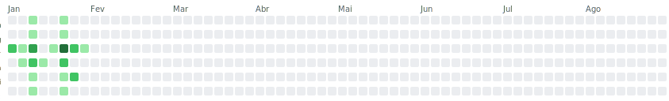

# Olá, eu sou o Thiago Silva 👋

Sou Desenvolvedor focado em ecossistemas de alta performance, atualmente atuando na **Avitaseg**. Especialista em transformar regras de negócio complexas em soluções técnicas escaláveis usando .NET.

---

## 📈 Atividade de Desenvolvimento (Ambiente Profissional)

Como minhas contribuições atuais ocorrem em repositórios privados da organização, compilei os dados de atividade para demonstrar meu ritmo e impacto técnico:

### 🟩 Heatmap de Contribuições - 2025

*Visualização do volume diário de commits em projetos core da Avitaseg.*

---

## 🛠 No que tenho trabalhado?

- **Back-end & APIs:** Arquitetura de microserviços e jobs com `.NET Core`.
- **Database Engineering:** Gestão de schemas e migrações complexas com `Liquibase` e `SQL Server`.
- **Data Engineering:** Pipelines de processamento de dados alfandegários (ETL) utilizando `Python` e `Jupyter Notebooks`.
- **Bibliotecas Core:** Manutenção de libraries compartilhadas que sustentam diversos sistemas da companhia.

---

## 📊 Estatísticas Consolidadas (Relatório 2025)

| Métrica | Total |
| :--- | :--- |
| **Commits Realizados** | 2.333 |
| **Linhas de Código Adicionadas** | 160.646 |
| **Repositórios Ativos** | 25+ |
| **Principais Techs** | .NET, SQL, Python, Angular |

---

## 📫 Contato

- **LinkedIn:** [www.linkedin.com/in/thiago-da-silva-goncalves-253234186]
- **E-mail:** [thiago.silva@avitaseg.com.br]

---
